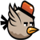
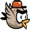

<h1>

<span style="margin:0 6px;">FlappyPy</span>

</h1>

A Python implementation of the classic Flappy Bird game built with pygame.


## 🎮 Game Features

- **Core Flappy Bird Gameplay** - Navigate your bird through pipe obstacles!
- **Scoring System** - Track your progress and compete for high scores
- **Physics-Based Movement** - Realistic gravity and jumping mechanics
- **Collision Detection** - Accurate detection for pipes and ground boundaries
- **Game Over & Restart** - Collision triggers game over, spacebar to restart
- **Smooth 60 FPS Animation** - Buttery smooth gameplay experience
- **Comprehensive Testing** - 50+ unit tests ensuring reliable gameplay
- **Professional Structure** - Clean, maintainable codebase

## 🚀 Quick Start

### Prerequisites

- Python 3.9 or higher
- pip (Python package installer)

### Installation

1. **Clone the repository**
   ```bash
   git clone https://github.com/unibo-dtm-se-2425-FlappyPy/artifact.git
   cd artifact
   ```

2. **Install dependencies**
   ```bash
   pip install -r requirements.txt
   ```

3. **Test your setup (optional)**
   ```bash
   python dev-tools/test_pygame.py
   ```

4. **Start playing!**
   ```bash
   python -m FlappyPy
   ```

## 🎯 How to Play

- **SPACEBAR** - Make the bird flap and fly upward
- **SPACEBAR** (when game over) - Restart the game

### Game Rules

1. Navigate your bird through the gaps between pipes
2. Each successful passage through pipes increases your score by 1 point
3. Avoid hitting pipes or the ground - both trigger game over
4. Try to beat your personal high score!
5. Use spacebar to jump and overcome gravity
6. Press spacebar after game over to play again

## 🏗️ Project Structure

```bash
FlappyPy/
├── FlappyPy/                      # Main game package
│   ├── assets/                    # Game assets
│   ├── __init__.py                # Package initialization
│   ├── __main__.py                # Game entry point
│   └── main.py                    # Complete game
├── test/                          # Unit tests
│   ├── __init__.py                # Test package initialization
│   ├── test_foundation.py         # Core game setup tests
│   ├── test_bird.py               # Bird physics tests
│   ├── test_physics.py            # Movement and gravity tests
│   ├── test_boundary.py           # Screen boundary tests
│   ├── test_pipe.py               # Pipe generation tests
│   ├── test_collision.py          # Collision detection tests
│   ├── test_score_display.py      # Scoring display test
│   ├── test_game_over_display.py  # Scoring display test
│   └── test_scoring.py            # Scoring system tests
├── requirements.txt               # Runtime dependencies
├── requirements-dev.txt           # Development dependencies
└── README.md                      # This file
```

## 🛠️ Development

### Setting up Development Environment

1. **Clone and setup**
   ```bash
   git clone https://github.com/unibo-dtm-se-2425-FlappyPy/artifact.git
   cd artifact
   pip install -r requirements-dev.txt
   ```

2. **Run tests**
   ```bash
   python -m unittest discover -s test -t .
   ```

3. **Test specific components**
   ```bash
   # Test game foundation
   python -m unittest test.test_foundation
   
   # Test environment setup
   python dev-tools/test_pygame.py
   ```

### Code Structure

- **`FlappyPy/main.py`** - Main game loop and pygame initialization, Classes, Functions and Constants

### Contributing

1. Fork the repository
2. Create a feature branch (`git checkout -b feature/feature-name`)
3. Make your changes
4. Add tests for new functionality
5. Ensure all tests pass (`python -m unittest discover -s test -t .`)
6. Commit your changes (`git commit -m 'Add the feature name'`)
7. Push to the branch (`git push origin feature/feature-name`)
8. Open a Pull Request

## 🧪 Testing

FlappyPy includes comprehensive unit tests to ensure game stability:

- **Foundation Tests** - Validate core game constants and settings
- **Physics Tests** - Verify bird movement and gravity mechanics
- **Collision Tests** - Ensure accurate hit detection
- **Scoring Tests** - Verify score calculation, persistence, and display
- **Rendering Tests** - Confirm graphics display correctly

Run all tests:
```bash
python -m unittest discover -s test -t .
```

## 📦 Building and Distribution

### Building for Distribution

```bash
python -m build
```

### Local Installation

```bash
pip install -e .
```

## 🎨 Game Customization

You can customize various aspects of the game by modifying constants in `FlappyPy/main.py`:

```python
# Window settings
WINDOW_WIDTH = 400        # Game window width
WINDOW_HEIGHT = 600       # Game window height
FPS = 60                  # Target frame rate

# Bird settings
BIRD_JUMP_STRENGTH = -8   # How high the bird jumps
BIRD_GRAVITY = 0.5        # Gravity effect on bird

# Pipe settings
PIPE_SPEED = 3            # How fast pipes move
PIPE_GAP = 150            # Gap size between pipes
```

## 🐛 Troubleshooting

### Common Issues

**"pygame not found" error**
```bash
pip install pygame==2.6.1
```

**"No module named FlappyPy" error**
- Ensure you're running from the project root directory
- Try: `python -m pip install -e .`

**Game runs too fast/slow**
- Check your system's display refresh rate
- Modify the `FPS` constant in the game settings

**No sound/audio issues**
- Ensure your system audio is working
- pygame audio initialization may fail on some systems - this is non-critical

### Performance Tips

- Close other applications for better performance
- Ensure Python 3.9+ for optimal pygame compatibility
- On older systems, reduce FPS in settings if needed

## 📄 License

This project is licensed under the Apache License 2.0 - see the [LICENSE](LICENSE) file for details.

## 🏆 Acknowledgments

- Inspired by the original Flappy Bird game by Dong Nguyen
- Built with [pygame](https://www.pygame.org/) - Python game development library
- Thanks to the Python community for excellent tooling and support

## 📈 Version History

- **1.2.0** - Enhanced User Experience
  - Animated bird with falling/flying states
  - Background music, sound effects, and game over audio

- **v1.1.0** - Scoring System Update
  - TDD approach development; Real-time score tracking and display
  - Enhanced game over screen with score information
  - Comprehensive scoring system tests

- **v1.0.0** - Initial release with core gameplay mechanics
  - Complete collision detection system
  - Physics-based bird movement with gravity  
  - Automatic pipe generation and movement
  - Game over and restart functionality
  - Comprehensive test coverage (44+ tests)

## 🔗 Links

- [Report a Bug](https://github.com/unibo-dtm-se-2425-FlappyPy/artifact/issues)
- [Request a Feature](https://github.com/unibo-dtm-se-2425-FlappyPy/artifact/issues)

---

**Made with ❤️ and Python** | *Happy Flying!* 🐦✨ 
